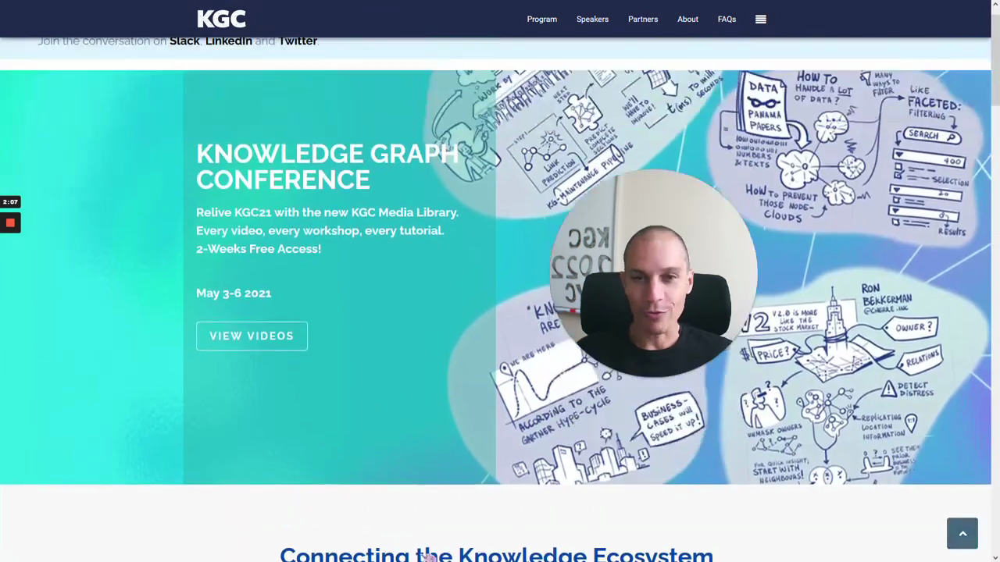
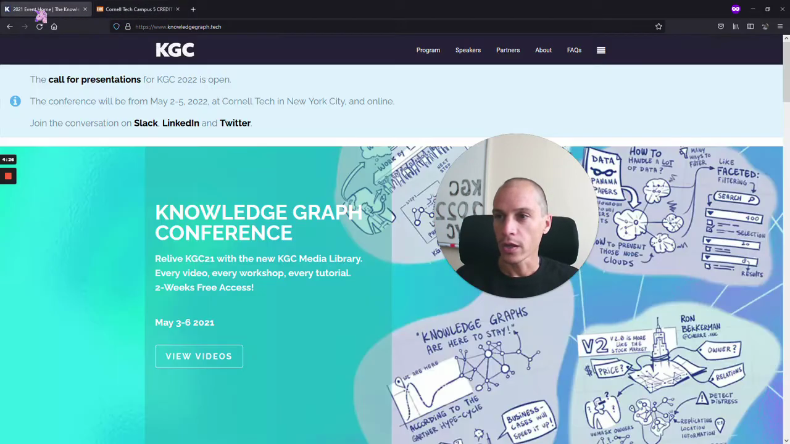

# Unveiling Knowledgecraft Conference 2022

As the founder and program chair of the Knowledgecraft Conference, I am thrilled to provide you with a sneak peek into the upcoming Knowledgecraft Conference 2022.

The conference aims to bring together experts and enthusiasts in the field of knowledge management to exchange ideas, insights, and best practices. It serves as a platform for networking, learning, and collaboration in an ever-evolving landscape of knowledge sharing.

### About Knowledgecraft Conference 2022

The Knowledgecraft Conference 2022 is set to be a transformative event, offering attendees the opportunity to delve into the latest trends and innovations in knowledge management. With a lineup of distinguished speakers and thought leaders, the conference promises to inspire and empower participants to harness the power of knowledge for personal and organizational growth.

Save the date and mark your calendars for an enriching experience at the Knowledgecraft Conference 2022.

### Connecting the Dots: Knowledgecraft Conference

Join us at the Knowledgecraft Conference 2022 to connect with like-minded individuals who share a passion for knowledge creation, dissemination, and utilization. Whether you are a seasoned professional or a budding enthusiast, this conference offers a unique platform to expand your horizons and forge meaningful connections within the knowledge management community.

### Conclusion

The Knowledgecraft Conference 2022 is not just an event; it is a gateway to a world of possibilities and opportunities in the realm of knowledge management. Don't miss this chance to be part of a transformative experience that will shape the way you perceive and leverage knowledge in your personal and professional endeavors.

Stay tuned for more updates and details on the Knowledgecraft Conference 2022. See you there!

---
By following these guidelines, we have transformed the initial transcription into a concise and informative blog post suitable for inclusion in a textbook.

# Unveiling the Call for Presentations at KGC Conference

Are you ready to showcase your expertise in knowledge and graph technologies? The Knowledge Graph Conference (KGC) is now accepting proposals for presentations, workshops, and tutorials. Whether you are inclined towards deep technical discussions, practical business use cases, or cutting-edge academic research, KGC provides a platform for all.

## Call for Presentations

KGC is a premier event that caters to technology enthusiasts, business professionals, and industry experts. The selection criteria for presentations prioritize the impact of the work being submitted. With multiple tracks available, including horizontal technical tracks like graph neural networks and ontology, as well as vertical tracks like life sciences and finance, there is a place for diverse topics and interests.

## Workshops and Tutorials

Workshops at KGC are organized by groups focusing on specific topics, ranging from academic research to industry-driven discussions. These sessions offer a deep dive into niche subjects and provide valuable insights for participants. Last year, workshops were conducted by esteemed organizations like the Enterprise Knowledge Craft Foundation.

## Get Involved

If you are passionate about sharing your knowledge, KGC invites you to submit your proposals and be a part of this technology-focused conference. Stay connected with the KGC community on Slack, LinkedIn, and Twitter for the latest updates and networking opportunities.

---

In conclusion, the Knowledge Graph Conference is a melting pot of ideas, innovations, and collaborations. Join us in shaping the future of knowledge and graph technologies.

